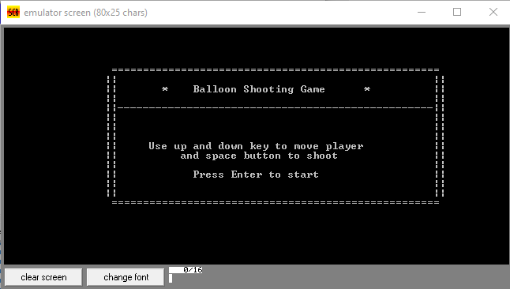
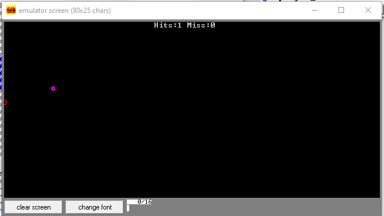
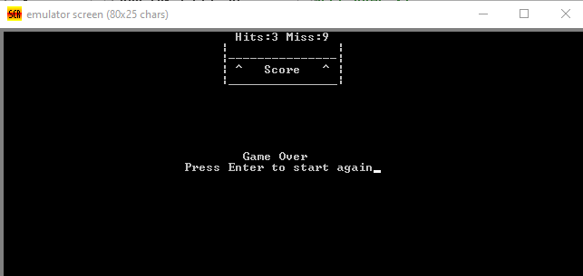

# 8086-Microprocessor-Game-in-Assembly-Language

⭐ If this repository helped you, consider giving it a star! 😊 ⭐  

---

This is a game developed with assembly language and tested in emu8086 (v4.08) emulator

All you need to copy the code from <code>game.asm</code> file and run it in emu8086.

### Summary
It’s a balloon shooting game where player shoots an arrow to hit the balloon and when the balloon gets hit it beeps and a new balloon pops up and you get to shoot another arrow towards it. 

I used few label and conditional jump statement to update logic and display everything.

#### Start Menu


#### Game Screen

💡 **Tip:** Do you see the tiny angle bracket? That’s our arrow! The purple circle is the bubble. If you press space while it's running, an arrow will appear.



#### End Menu


### Contribution  

If you create something cool based on this project or have a similar project, feel free to share it here!  
Please create a pull request to update this README file and add your GitHub repository link.  

### Community Creations:  
1. < Your cool game repository here >

------

#### Code explanations:

```
Main_loop:
  This is where logical part of game, handling user inputs and visually rendering happens.

  Inside_loop:
    Checks collision detection
    Changes direction of player
    Hides arrow when it gets out of viewport
    If there isn’t  any balloon on viewport it fires a new one

  Hit: 
    Plays sound (beep)
  
  Render_loon:
    The balloon moves upwards

  Render_arrow:
    Moves arrow forwards
  
  Inside_loop2:
    Render player on viewport

  Handling user input:
    Check if any key is pressed 
  
  upKey
    set player's direction to up
  
  downKey
    set player's direction to down
  
  spaceKey
    If no arrow on screen fire new one
```

### Used Procedures

```
 clear_screen: it clear the screen. <br>
 show_score: This procedure used for display score in same position on screen.
```


